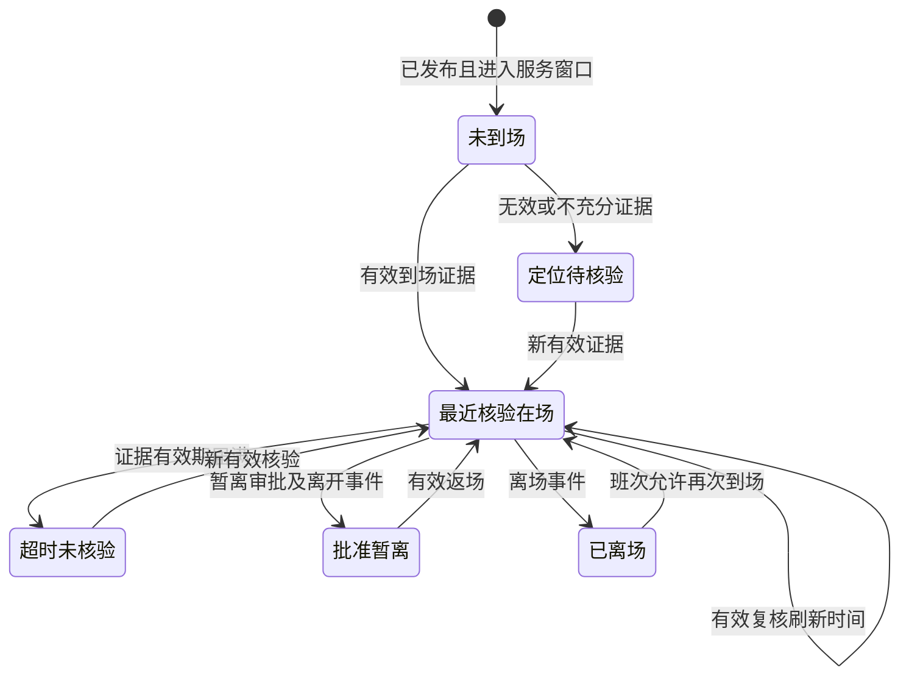

# 售后管理系统开发任务书

版本 V1.0｜编制日期 2026-09-29｜状态：供业务删减和开发执行的方案，尚未实施。

本任务书基于 EHR 提交 `051b38f04b0e33f1e624da35fa57ecae9fd4974f` 提炼。配套文件：[业务逻辑](01-完整业务逻辑提炼.md)、[231 项候选功能](02-可删减功能清单.md)、[源码索引](04-源码证据索引.md)。文中“必须”是目标系统验收要求，不代表原系统已满足。

## 1. 目标与交付边界

建设可独立运行的售后现场陪产人员管理系统，完成客户项目/现场建档、人员派驻、规则排班、手机到离场核验、期间复核、异常申请、模板审批、业务生效、统计确认和审计追溯。

必须回答“谁应在场、谁最近核验过、证据何时过期、谁已离场、谁获批暂离、谁需要复核”。不得把出差审批、补卡认可、上下班两卡齐全或工时达标直接显示为持续在场证明。

本任务书保持宽范围候选。实施范围以功能清单中每项决定及对应交付阶段为准；未删减前不得自行删除原有关联规则，但可通过开关后置 P1/P2 能力。P0 是完整核心闭环要求，不是对工期或人数的承诺。

第一条闭环不依赖完整 HR、薪资、招聘、绩效、培训、行政资产、聊天会议，也不依赖客户外部账号。实际发送企微/短信、原生 App 发布、门禁集成和财务支付均需独立配置与验收。

## 2. 系统形态与技术原则

### 2.1 首选抽取路线

为尽量保留业务逻辑，首选沿用源系统技术体系：FastAPI、SQLAlchemy Async、Pydantic、Alembic；PC 使用 Vue 3 + Element Plus；手机使用 Ionic Vue H5，按需要保留 Capacitor；数据库沿用 MySQL 适配路线。

以上是建议路线，不要求照抄旧依赖版本。开发启动时核对 Python/Node、锁文件和目标数据库版本，建立可复现环境。原服务注释中的 PostgreSQL 描述与当前数据库实现存在差异，以当前实际配置/驱动代码为准；若改 PostgreSQL 或其他平台技术栈，需单列迁移工作包。

后端、管理端、H5、数据库、文件存储和后台任务应能在独立环境启动；禁止引用 EHR 生产数据库或复制生产凭据。原 Compose 只描述部分服务，不是可直接交付的新系统全套部署。

### 2.2 建议模块边界

```text
backend/
  identity/       身份及账号状态
  directory/      人员组织与数据范围
  field_service/  客户项目现场、任务与派驻
  attendance/     规则、班次、事件、日结果、补卡资格
  presence/       在场判断、会话、核验任务与异常
  approval/       模板、版本、表单、流程、实例与动作
  reporting/      日月报、确认、锁定、导出
  integrations/   文件、通知、业务事件和外部系统适配
  jobs/           重试、重算、超时及导出工作器
admin-web/
mobile-web/
migrations/
tests/
deploy/
docs/
```

允许保留原目录名称，但职责边界必须清楚。业务判断放后端服务；前端预检仅用于提示；手机和 PC 使用同一领域规则。不要把 1 万行考勤服务原样作为新系统唯一业务入口。

### 2.3 为后续平台接入保留端口

| 端口 | 职责 | 独立运行实现 |
|---|---|---|
| IdentityPort | 当前身份、账号启停、认证信息 | 本地认证适配 |
| DirectoryPort | 人员、组织、负责人、项目范围 | 本地目录服务 |
| FileStoragePort | 上传、元数据、授权下载、归档 | 私有文件卷或 S3 兼容存储 |
| ApprovalPort | 发起、状态、撤回及终态订阅 | 本系统审批引擎 |
| NotificationPort | 待办提醒、结果通知、去重 | 站内通知优先 |
| EventPort | 业务事件、消费状态、重试 | 本地 outbox/consumer/job |

领域服务不能直接绑定特定 JWT、企微、对象存储 SDK 或另一系统的数据表。平台接入不改变原始事件、派驻和审批实例的业务 ID。

## 3. 角色、范围及操作权限

| 角色 | 数据范围 | 主要操作 |
|---|---|---|
| 陪产人员 | 本人及被派驻任务必要信息 | 打卡、核验、日报、申请、查看本人结果、确认本人月报 |
| 现场负责人 | 明确分配的现场和有效任期 | 查看现场人员、复核异常、现场审批、排班/交接办理 |
| 项目负责人 | 负责项目及其现场 | 派驻调配、变更审批、项目报表和确认 |
| 售后管理 | 被授权售后范围 | 维护任务、规则、模板、全域协调、月报锁定 |
| 审批模板管理员 | 指定模板 | 编辑、预览、发布与停用；不因此获取所有业务数据 |
| 系统管理员 | 技术配置范围 | 账号角色、任务监控、受控运维；业务批准需显式授予角色 |
| 审计/只读 | 授权项目或期间 | 查询历史、证据和审计，无修改权限 |
| 客户确认人（选装） | 被邀请的任务/单据 | 查看有限摘要、确认或提出异议 |

权限必须同时约束菜单、按钮、API、后台作业、导出与附件。后端应提供统一 `DataScope`，列表、总数、聚合、详情、关联选择均使用。未授权项目不能通过猜 ID、关联审批单、导出任务或文件 URL 访问。

审批人由后端解析并固定任务。申请人是负责人时走预先配置的上级/替代人或显式自审政策，不允许无提示自批关键例外。转审和委托不得扩大被授权业务范围。

## 4. 目标数据模型与约束

以下为建议逻辑实体，命名可调整；“原”表示可参考 EHR 模型，“新”表示新增/重要拆分。必须输出 ER 图、字段字典、索引及迁移脚本。

| 实体 | 关键字段/关系 | 必须约束 | 来源 |
|---|---|---|---|
| person / account | 稳定人员 ID、外部标识、状态、单位、部门 | 不以姓名为主键；停用保留历史 | 原改造 |
| role_assignment / data_scope | 角色、项目/现场、有效起止 | 唯一范围、到期失效、审计 | 新 |
| customer / project | 编号、客户、负责人、状态 | 编号唯一；历史不硬删 | 新 |
| site / site_version | 项目、地址、时区、坐标系、围栏 | 版本固定、半径合法、修改可追踪 | 新 |
| service_task | 项目/现场、期间、需求人数、负责人 | 有效起止及状态机校验 | 新 |
| assignment / assignment_version | 人员、任务、现场、起止、批准实例 | 时间重叠检查、版本不可回写旧事实 | 新 |
| attendance_rule_version | 类型、时间、方法、阈值、适用范围 | 草稿/发布、版本唯一、有效区间 | 原改造 |
| shift_instance | 人员、派驻、服务日期、起止时间戳 | 每段有独立 ID，跨夜归属不依赖服务器日期 | 原改造 |
| work_calendar | 现场/全局、日期、日类型 | 同范围同日期唯一 | 原 |
| presence_event | 人员、班次、现场、事件类型、证据、时间 | 只追加；请求幂等键唯一 | 原流水扩展 |
| evidence_file | 上传人、对象键、哈希、大小、类型、引用 | 业务授权；禁止任意外链冒充证据 | 原改造 |
| presence_session | 到场、离场、暂离、返场事件关联 | 一人同一时间不能正常驻留两个现场 | 新 |
| verification_task | 应答窗口、人员、规则版本、状态、结果 | 同业务任务幂等，超时与应答竞态受控 | 新 |
| anomaly_case | 类型、证据、责任人、状态、处置 | 重复检测去重、完整状态历史 | 新 |
| attendance_day_result | 班次、规则版本、结果版本、指标 | 可重建；标签、认可结果和原始事实分离 | 原改造 |
| approval_template/version | 业务编码、表单/流程/权限快照 | 模板编码唯一；版本不可变；发布与草稿隔离 | 原改造 |
| approval_instance | 版本、申请人、业务对象、状态、revision | 提交幂等、状态版本锁 | 原改造 |
| approval_task/action | 节点、支路、处理人、意见、时间 | 同待办仅一次有效处理；审计动作不可覆盖 | 原改造 |
| approval_delegate | 委托人、代理人、范围、日期 | 不自委托、无环、有限期、可撤销 | 原改造 |
| attendance_effect | 来源实例、作用人员/时段、类型、状态 | 来源和作用键去重，撤销保留记录 | 原 |
| business_outbox/consumption | event_id、幂等键、载荷版本、状态 | 每消费者幂等；事务提交后可恢复分发 | 原改造 |
| job | 类型、业务键、租约、重试、错误、结果 | 持久化、失败重试、进程重启可恢复 | 新 |
| service_report / confirmation | 人员项目现场期间、确认人、版本 | 汇总与证据关联；确认人范围合法 | 原改造 |
| locked_snapshot / adjustment | 冻结版本、原快照、变更依据 | 锁定后不覆盖；调整单产生新版本 | 新 |
| audit_log / notification | 操作者、动作、对象、前后值/收件人 | 受控访问，关键操作可追溯 | 原改造 |

所有业务实体带创建/更新时间与操作者；涉历史的关联对象用停用或归档，不以级联删除清空证据。时间统一存 UTC，业务日通过现场时区和班次计算；金额、时长使用明确单位，不能混用小时、天与分钟。

## 5. 到场、离场和在场核验规则

### 5.1 预检与正式提交

预检输入本人身份、任务/班次、事件类型、定位采集信息；输出适用规则、时间窗、预期动作、距离、精度、异常码与可提交类型。正式提交必须重新验证，不能信任前端预检结论。

有效核验须同时满足：身份有效、当前派驻有效、现场与任务一致、班次窗口允许、定位/照片策略满足、证据时间未过期。没有规则、围栏坐标缺失、定位失败、文件未上传成功均不得获得正常有效核验。

异常记录可以按策略保存，但响应必须分别包含：是否收到、是否有效核验、是否需要申请、当前现场判断、拒绝/风险原因。保留幂等重试能力；网络超时重发返回相同结果，不重复增加统计。

### 5.2 定位证据字段

必须保存：原始经纬度、坐标系、转换后用于计算的坐标、提供方、精度、客户端采集时间、服务器接收时间、距离、围栏版本、有效性原因、设备来源说明和可用的风险信号。

浏览器 H5 不得假定能稳定读取 Wi-Fi、后台持续定位或完整识别模拟定位。IP 定位只可辅助显示。若需要强设备认证、蓝牙/门禁或后台核验，新增独立能力并真机验证。

图片必须先完成受控上传再引用，后端验证上传人、所属业务、文件存在及可访问；不接受 `outside:...` 占位串作为已拍照片。水印、文件哈希只用于追溯和去重，不单独宣称证明真实性。

### 5.3 当前状态计算



冲突或人工认可不强行进入“最近核验在场”。“不在服务窗口”作为当前班次外的独立视图状态；任务结束不能使缺失离场证据变成真实离场事件。

期间核验分为定时、负责人临时发起和可选随机。任务必须持久化；错过窗口标未响应/待复核，不等同于已证实脱岗。提醒去重，明确本人、现场负责人、售后管理的升级顺序。

### 5.4 工时和指标

- 计划服务分钟：已生效派驻班次与服务日历的交集，扣除规则中的休息及获批免在场时段。
- 事件区间分钟：从有效到场/离场、暂离/返场形成的区间，只表示端点事件支持的区间。
- 核验有效覆盖分钟：按已确认的证据有效期策略合并区间、裁剪到班次并去重；名称必须表明这是规则推定值。
- 人工认可分钟：批准的认可时段经授权、重叠去重后形成，和实测证据分别展示。
- 结算认可分钟：按项目政策对上述数据处理，保留计算版本，不等同法律工时或工资结论。

到场人数、暂离人数、已离场人数、待核验人数的统计时间点一致，互斥视图不能重复计人数。应到名单必须包含零打卡人员。跨现场统计应按人员去重并保留班次明细，不能简单相加造成重复。

## 6. 规则、派驻与补卡配置

所有关键规则应有版本、适用范围、生效区间、审批/发布人和修改日志。预览必须显示指定人员在指定班次最终命中的规则及原因；并列冲突不得仅靠后台隐藏选择结果。

必须校验：班次起止、跨夜边界、休息段重叠、围栏和精度阈值、时间窗、证据有效期、补卡限额、月锁、人员状态及生效时间。固定班不得通过误配全天窗口掩盖迟到和工时不足。

补卡统一执行：资格查询 → 正式提交复查 → 审批前复查月锁/派驻/重复 → 通过后幂等生成修正影响 → 重算并通知。月次数计数口径需配置并固定（待审批是否占额度、驳回是否释放），不得每个入口各算一套。

已锁期间禁止直接修改基础记录或生效会改变锁定结论的审批；需通过调整单、保留原快照、生成新版本及重新确认。请求锁定与并发补卡批准必须串行化或采用一致的版本/事务锁。

## 7. 模板库与动态表单

预置模板以业务逻辑文件中的 18 类候选为基础：派驻、延期/结束、替班、调配、补卡、定位异常、暂离、请假、出差、加班、复核申诉、日报、客户确认、月确认、锁后调整、规则变更、外协准入、费用补贴。选装模板可隐藏但不要删除已产生版本。

每个模板必须定义：稳定业务编码、展示名称、分组、可发起范围、模板管理员、字段 schema、节点配置、结果绑定、通知、启停、生效版本和历史版本。

表单必须后端校验必填、类型、范围、选项、日期先后、业务 ID 权限、附件、明细子项、只读字段和当前节点允许编辑字段。隐藏字段不得通过构造请求写入；公式不得执行任意代码，金额和时长服务端重算。

模板保存为草稿；发布时验证唯一业务编码、字段编码、控件支持、负责人来源、分支默认路由、并行结构和业务绑定。模板没有有效流程或处理人策略不完整时禁止发布。禁止提交时自动创建一个未经检查的“发布版本”。

复制模板要产生新编码、新对象和新版本；停用只关闭新申请；历史实例详情、附件、导出按其快照渲染。模板 ID、业务对象 ID、审批实例 ID 不得混用。

原已禁用的 AI、OCR、流水号等在本系统保持不可用，直到相应实现和验收完成。项目、客户、合同等业务控件必须声明实际数据提供方，不能做一个文本框就称已经接入该系统。

## 8. 审批引擎实施要求

### 8.1 必须保留的运行能力

审批/办理/抄送/自动节点、实际负责人解析、或签/会签、条件分支和唯一默认分支、流程快照、待办/已办/发起/抄送、同意/拒绝/转审、本人撤回、意见、附件、进度和通知。

顺签、票决、多级主管、并行、委托、批量审批按清单保留候选。并行依源能力先限制为不可嵌套；如开启高级配置，必须有执行实现和验收，不能仅保存 JSON。

### 8.2 状态转换

| 对象 | 合法转换 | 限制 |
|---|---|---|
| 模板版本 | 草稿 → 已发布 → 停用/归档 | 发布版本不可编辑覆盖 |
| 审批实例 | 待审批 → 已通过 / 已拒绝 / 已撤回 | 终态不可重复执行普通动作 |
| 审批任务 | 待处理 → 完成 / 转交 / 取消 | 同一任务一次有效处理，后续请求返回冲突或原结果 |
| 业务生效 | 等待 → 处理中 → 已生效 / 失败待重试 | 和审批终态分开显示 |
| 影响记录 | 有效 → 已撤销 | 撤销不删除历史，并执行受控冲正 |
| 异常工单 | 待处理 → 补充材料 / 待审批 → 已解释 / 已确认异常 / 关闭 | 每次转换记录原因及操作者 |

批准终态后的撤销必须单列撤销申请，不复用 pending 撤回。撤销已生效派驻、补卡、月锁、加班必须验证下游冲正。未开发此能力时入口明确禁用。

### 8.3 并发与权限

审批动作必须校验实例 revision、任务状态和操作人；竞争批准、拒绝、撤回、转审时只有合法的一次转换生效。或签其他任务应取消；会签未完成不得推进；票决用固定任务集合计票，转审不能多产生有效票。

空审批人处理、离职处理、主管循环、同人多个节点、申请人是负责人均需明确策略。自动通过要记录策略版本和原因，关键例外不得因解析失败自动放行。

## 9. 业务事件、回写与定时任务

审批终态、任务变更等与 outbox 写入置于同一数据库事务。消费者按 `event_id + consumer` 去重；效果按来源实例、版本和作用范围去重。重试不能重复增加补卡、工时、余额或通知。

工作器应具备持久任务、认领租约、超时重收、退避、尝试次数、错误详情、人工重放和结果状态。至少承载核验过期、待到场检查、通知升级、审批业务回写、日月重算和导出。

原 dirty 标记可作输入，但必须实现从 pending 到完成/失败的真正重算；不能仅建立表或展示监控页。多实例运行、进程重启以及同一任务重复投递都应有测试。

对外通知通过适配器发出。失败不回滚已成功业务，但必须在任务/消息状态可见；通知本身不授予审批或查看权限。

## 10. 页面和 API 交付清单

### 10.1 页面

| 端 | 页面组 | 关键操作与信息 |
|---|---|---|
| 手机员工 | 首页/任务 | 今日派驻、现场、计划班次、最近证据、待完成事项 |
| 手机员工 | 到离场核验 | 地图、精度、围栏、照片、预检、有效性结果 |
| 手机员工 | 个人记录 | 打卡流水、日结果、申请状态、异常解释、月确认 |
| 手机员工 | 动态申请/详情 | 模板、字段、附件、流程预览、撤回、进度与生效状态 |
| 手机负责人 | 现场/团队 | 应到清单、核验时间、暂离、异常、下钻和分页 |
| 手机负责人 | 审批与复核 | 待办、证据、意见、批准/拒绝/转审、核验任务 |
| PC | 基础档案 | 人员组织、客户、项目、现场、围栏及权限 |
| PC | 派驻排班 | 任务、需求人数、有效安排、冲突和变更 |
| PC | 现场总览/异常 | 实时点位判断、更新时间、异常责任、处理闭环 |
| PC | 考勤记录/规则 | 规则版本、流水、日结果、补卡资格、日历 |
| PC | 审批/模板 | 流程画布、表单设计、预览、发布、版本和归档 |
| PC | 报表/确认 | 条件筛选、导出任务、本人/项目确认、锁定和调整 |
| PC | 系统运维 | 事件、任务、失败重试、审计、存储、配置 |

所有数据页具备加载、空数据、部分失败、无权限和重试状态。统计接口失败不能用 0 掩盖；地图点位必须展示采集时间，过期位置不能当作实时位置。

### 10.2 新系统建议接口契约

以下是目标 API 草案，非原 EHR 现有接口；原 109 条考勤/审批路由见证据索引。建议统一 `/api/v1`，以 OpenAPI 生成两端类型。

| 接口组 | 代表接口 | 契约要求 |
|---|---|---|
| 基础目录 | `GET /me`、`GET /people`、`GET /projects`、`GET /sites` | 权限范围及分页总数一致 |
| 任务派驻 | `POST /service-tasks`、`POST /assignments`、`POST /assignment-changes` | 幂等键、状态版本、冲突响应 |
| 班次规则 | `GET /my/shifts`、`POST /rules/preview`、`POST /rules/{id}/publish` | 返回命中版本及匹配原因 |
| 核验预检 | `POST /presence/precheck` | 返回服务窗口、距离、规则及可提交类型 |
| 核验提交 | `POST /presence/events` | received、verified、reasons、判断状态、证据ID及时间 |
| 当前状态 | `GET /presence/status`、`GET /sites/{id}/presence` | as_of、last_verified_at、valid_until、reason_codes |
| 复核任务 | `GET /verification-tasks`、`POST /verification-tasks/{id}/respond` | 任务版本、有效窗口、证据引用 |
| 异常 | `GET /anomalies`、`POST /anomalies/{id}/actions` | 责任、动作历史及状态机 |
| 补卡 | `POST /punch-corrections/eligibility`、`POST /applications` | 资格复查与正式提交共用规则 |
| 模板 | `POST /templates`、`POST /templates/{id}/publish`、`GET /templates/{id}/versions` | 草稿不生效，快照可追溯 |
| 审批 | `GET /approval-center`、`GET /instances/{id}`、`POST /tasks/{id}/actions` | 当前任务权限、revision、意见、动作ID |
| 文件 | `POST /files`、`GET /files/{id}/download` | 私有对象、业务授权、禁止公共裸目录 |
| 报表 | `POST /report-jobs`、`GET /report-jobs/{id}`、`GET /reports/{id}` | 查询范围快照、授权复查、错误明确 |
| 确认锁定 | `POST /reports/{id}/confirm`、`POST /reports/{id}/lock`、`POST /adjustments` | 版本冲突、锁定范围、调整关联 |
| 运维 | `GET /jobs`、`POST /jobs/{id}/retry`、`GET /audit-logs` | 受控权限、重试原因和执行记录 |

必须统一业务错误码：无派驻、无有效规则、时段不符、围栏外、定位精度不足、定位过期、文件无效、重复待审、补卡超限、月度锁定、任务已处理、无权访问、业务生效失败。保留 HTTP 401/403/409/422/500 等明确语义，不以 HTTP 200 包装所有异常。

## 11. 代码抽取与依赖处理步骤

1. 固定源提交并建立新仓库；保存源文件映射和版权/授权信息，不修改源 EHR 生产环境。
2. 建立独立环境及最小人员组织、权限、文件、通知、事件能力。
3. 迁移考勤模型、规则匹配、日历、班次、流水及报表计算；把薪资/调休依赖改为可选适配器。
4. 迁移审批模型、模板、画布、动态表单、任务、动作及可复用测试；将招聘/薪资/离职等 `_sync_business_status` 分支改为按业务类型注册的处理器。
5. 新增客户项目现场、任务派驻、现场事件和状态服务；打卡及审批以新的业务 ID 关联。
6. 迁移手机页并替换工作台入口；团队页改用受数据范围保护的聚合接口，不能保留首批 30 人及 N+1 请求作为全量统计。
7. 迁移 PC 页面并拆分大组件；按项目/现场组织列表和报表。
8. 整理独立数据库迁移及模板种子；不得把原数据库完整导入作为启动前提。
9. 修复业务逻辑文件 G01—G22；逐项标注已完成、后置或禁用，不能遗漏到实现边界外。
10. 执行下述验收，产出证据；完成后才进入真实设备和现场试点。

若需搬迁真实历史，另建映射与演练：人员稳定 ID、组织、规则、模板版本、实例、任务/动作、文件及旧单号全链核对；行数、关联、哈希和抽样详情一致。当前任务未授权生产数据迁移或新系统部署。

## 12. 验收用例

验收必须记录输入、期望、实际结果及可复现方式。下列 60 项是核心门槛；开启的 P1/P2 功能另补相应用例。

| 编号 | 场景 | 通过标准 |
|---|---|---|
| A01 | 有效派驻内到场 | 命中正确现场、班次及规则，生成有效证据与状态 |
| A02 | 无派驻打卡 | 不显示正常到场，说明原因且可走例外路径 |
| A03 | 无规则/围栏缺配置 | 发布或核验被明确拦截 |
| A04 | 错现场证据 | 不用于另一现场或另一项目的到场 |
| A05 | 围栏边界内外 | 距离计算及边界规则一致且可复现 |
| A06 | GPS/Wi-Fi任一与全部 | 两种策略结果符合配置，手机与服务端一致 |
| A07 | 精度不足 | 进入待核验，不通过正常到场 |
| A08 | 过旧坐标 | 不能重放成当前核验 |
| A09 | IP定位回退 | 仅作辅助显示，不通过现场证明 |
| A10 | 必拍但无真实文件 | 占位字符串/他人文件/上传失败均不通过 |
| A11 | 异常仍记录 | “接收成功”与“有效核验失败”清楚分开 |
| A12 | 网络重试 | 相同幂等键仅一条有效事件，不重复统计 |
| A13 | 同时提交到场 | 会话与事件去重符合约束，无双重正常驻场 |
| A14 | 最早最晚卡中间暂离 | 暂离区间可见，不把全天跨度称持续服务 |
| A15 | 证据过期 | 后台任务使状态转超时未核验并保留最后时间 |
| A16 | 新复核响应 | 刷新有效期且只更新对应人员/班次 |
| A17 | 错过核验窗口 | 产生未响应异常，不自动伪造离场 |
| A18 | 批准暂离并返场 | 批准区间和实际事件分别留痕，返场需证据 |
| A19 | 跨夜班 | 次日下班属于原班次，日期和工时正确 |
| A20 | 同日两现场重叠派驻 | 拒绝冲突或要求受控变更，不自动双计 |
| A21 | 自由/弹性工时不足 | 不因两卡齐全掩盖配置的最低工时异常 |
| A22 | 同分钟上下班/全天误配 | 明确时间或配置异常，不能无条件正常 |
| A23 | 全日无打卡 | 仍出现在应到清单及缺证据统计 |
| A24 | 规则并列和新旧生效 | 匹配结果可解释，历史不随新版本漂移 |
| A25 | 请假/出差审批 | 影响义务或行程，不自动增加现场核验人数 |
| A26 | 补卡资格各限制 | 窗口、次数、卡点、重复、无规则、锁月全部有明确结果 |
| A27 | 构造动态模板绕过资格 | 正式提交/批准仍由同一资格规则阻止 |
| A28 | 补卡通过 | 新增审批来源修正，原GPS和原异常可查 |
| A29 | 人工异常认可 | 只改变认可状态，不伪造采集事实 |
| A30 | 模板草稿 | 员工不可发起，旧发布版本正常工作 |
| A31 | 模板版本切换 | 在途和历史使用原快照，新单使用新版本 |
| A32 | 模板停用与复制 | 禁新单但保历史，复制为独立编码及版本 |
| A33 | 表单后端校验 | 必填、选项、关联ID、只读、隐藏、文件、明细均不可绕过 |
| A34 | 条件命中及默认分支 | 优先级、组合条件、默认支和回主干正确 |
| A35 | 或签及会签 | 或签一人通过关闭其他待办；会签未齐不推进 |
| A36 | 顺签/票决（若开） | 顺序及票数准确，转审不增票 |
| A37 | 并行审批（若开） | 全分支完成才汇聚，拒绝/票决按规则，嵌套并行明确拒绝 |
| A38 | 负责人缺失/循环/离职 | 不静默通过，按策略转指定处理人或拒绝 |
| A39 | 非待办人操作 | API拒绝，无状态变化 |
| A40 | 并发同意拒绝撤回 | 只产生合法终态和一次业务生效 |
| A41 | 转审与委托（若开） | 受范围日期约束，原处理链可查 |
| A42 | pending撤回 | 本人可撤回，待办关闭，终态再操作被拒绝 |
| A43 | 审批生效失败 | 审批状态保留，业务显示待重试，修复后只生效一次 |
| A44 | 重复事件与消费者重启 | 不重复补卡、时长、余额或通知 |
| A45 | 重算任务 | 真正更新日/月结果，版本可查，不只留dirty标记 |
| A46 | 跨项目访问 | 列表、聚合、详情、选人、附件、导出均无越权 |
| A47 | 人员停用 | 无新登录/新派驻，历史仍能按授权查看 |
| A48 | 超过30人团队 | 分页和聚合全量正确，前后端字段一致 |
| A49 | 日月指标下钻 | 汇总可与人员班次及事件明细对账 |
| A50 | 重叠时段与跨日统计 | 休息、请假、外出、认可去重且单位一致 |
| A51 | 报表导出及下载 | 与筛选及权限范围一致，无他人任务结果泄露 |
| A52 | 本人确认 | 只能确认本人对应版本，变更后需重新确认 |
| A53 | 月度锁定 | 未确认或有阻断争议按策略处理；锁定版本不可覆盖 |
| A54 | 锁定与补卡并发 | 不产生已锁快照和基础事实静默不一致 |
| A55 | 锁定后调整 | 生成调整版本并保留原版，重新确认可追溯 |
| A56 | 运行任务进程重启 | 核验、导出、重算及事件任务可恢复 |
| A57 | 通知失败及重复触发 | 有失败状态、可重试且成功通知不重复轰炸 |
| A58 | 真机定位权限与弱网 | 代表性iOS/Android H5正常/拒绝/断网均有可用流程 |
| A59 | 数据库和附件恢复 | 新环境恢复后抽样单据、证据、审批历史能打开 |
| A60 | 独立部署 | 未连EHR数据库/生产服务仍可完成一整条现场核验审批报表闭环 |

可复用测试起点见原 `backend/tests/test_attendance_*`、`test_approval_*`、`test_business_event_linkage.py`、`test_deps_auth.py`、`test_upload_file_types.py`。迁移测试必须检查真实业务效果；静态字符串断言不能代替集成和端到端验收。

## 13. 分阶段开发与交付门槛

| 阶段 | 工作包 | 可检查交付物 | 结束条件 |
|---|---|---|---|
| D0 业务定稿 | 逐项处理231项候选及18类模板 | 保留清单、参数表、角色范围表、变更记录 | 阈值和边界明确；未决项有默认禁用策略 |
| D1 抽取底座 | 独立工程、身份组织、权限文件、规则模板、迁移 | 可启动工程、ER、API、最小种子、源映射 | 两端登录，模板及规则能持久保存，未接生产 |
| D2 现场闭环 | 项目现场、任务派驻、班次、核验、状态、异常 | PC+H5可演示闭环、A01—A29相应证据 | 无计划/无规则/无效证据不会误判到场 |
| D3 审批生效 | 模板发布、任务、审批、事件、补卡及变更 | 模板库、动作日志、失败重试及集成测试 | A30—A45及开启的高级流程通过 |
| D4 日常管理 | 报表、确认锁定、批量、通知、运维 | 可对账报表、锁定调整、任务监控、恢复报告 | A46—A60中本阶段门槛通过 |
| D5 现场试点 | 真机、弱网、真实围栏、负责人业务演练 | 试点记录、问题清单、修复与复验记录 | 业务逐场景签收后另行决定发布 |

P1/P2 按功能开关插入对应阶段；不得因阶段演示完成就将全部 231 项标为已实现。源系统已有测试需要按提炼后的依赖和新权限重新运行。

## 14. 最终开发交付物

必须包含：独立源码及提交、安装启动文档、配置样例（无真实密钥）、数据库迁移、最小种子、ER/字段字典、OpenAPI、权限矩阵、规则/模板样例、保留功能清单、源映射、自动化测试与结果、真机记录、报表对账、备份恢复报告、失败任务处理及回滚说明。

交付状态必须逐项区分“文档已提炼、源码已抽取、可启动、测试通过、试点通过、已部署、已业务验收”。本次仅完成第一项文档提炼，不包含软件实现、部署、生产迁移或现场验收。
